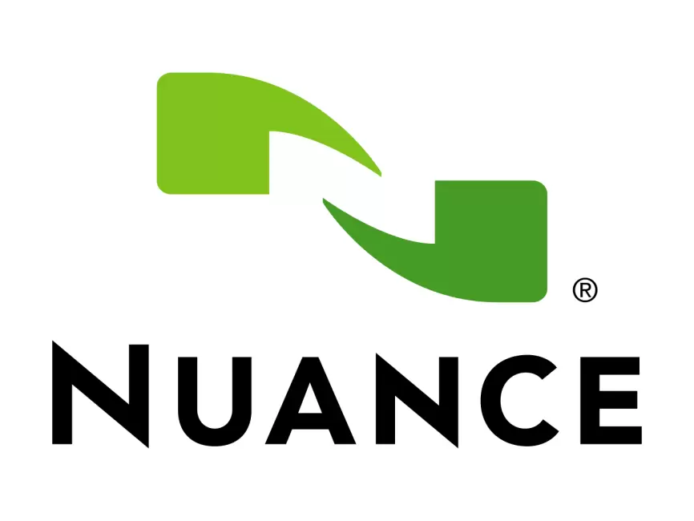
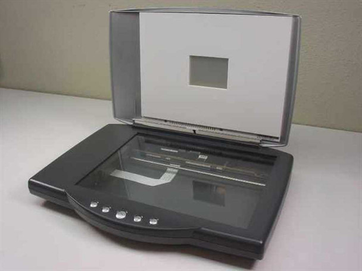
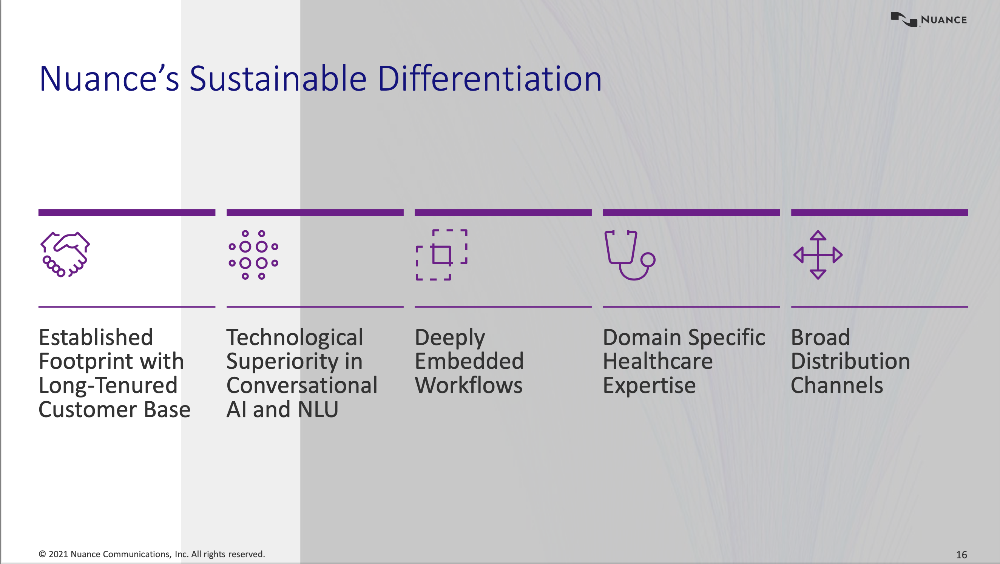
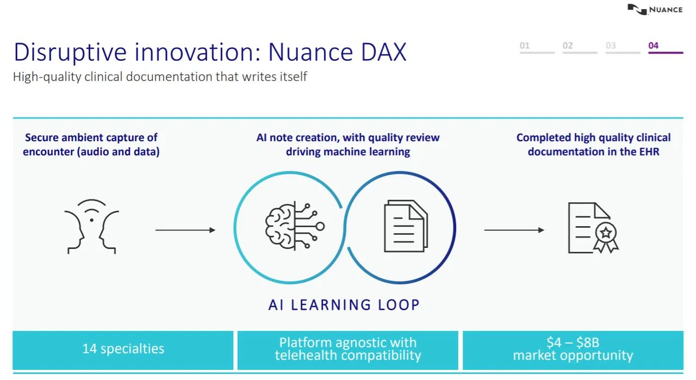
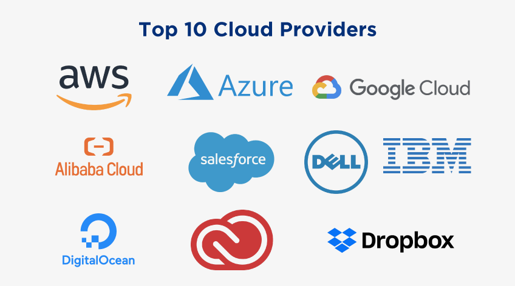
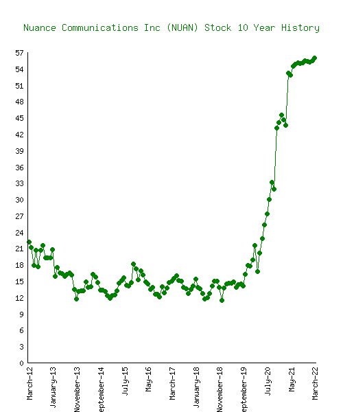

***
# Overview

>*Nuance is known for conversational AI technology and cloud-based strategies.  The technology is applied across a variety of industries but most notably in healthcare with clinical documentation solutions.* 

## Nuance's Incorporation

---

Nuance was originally incorporated as Visioneer in 1992.  The company has morphed and changed names through a series of acquisitions and mergers before officially adopting the name of [Nuance](https://www.computerworld.com/article/2556291/scansoft-to-buy-nuance-for--220m.html) in 2005 during a merger with Scansoft.  Nuance's merger with Scansoft in 2005 for 220 million dollars was a big deal as the Nuance would then control 77% of the market for speech recognition.*

## Nuance's Originators
---
### Pier-Alain Cotte 

The seeds for Nuance were planted in 1992 when Mr. Cotte founded Visioneer.  At that time, Visioneer focused on "intelligent document capture solutions" or scanners. 

<i>Pierre-Alain Cotte, Visioneer founder, 1992</i>

### Ronald Croen 

Mr. Croen co-founded Nuance in 1994 with colleagues from SRI International.  Once Nuance spunoff from SRI International, Croen served as Nuance's CEO for 10 years until a merger with Scansoft (which had previously merged with Visioneer).   

<i>Ronald Croen, Nuance Communications co-founder, 2005</i>

## The Motivation Behind Nuance 
---
### The Overall Inspiration for Nuance

Nuance has evolved over the years to include digital document management, voice recognition, natural language processing, artificial intelligence, decision support, and other techonologies.  Throughout, it has been driven to improve the productivity, efficiency, and seamless experience of information flow.

### Visioneer and Beyond
Though there was widespead adoption of personal computing by the 1980s and early 1990s, work still necessitated the frequent use of paper.  Visioneer made it possible for a regular employee to conveniently convert paper documents to digital with sheetfed scanners.  Later advances such as the [OneTouch](https://www.visioneer.com/visioneer-intelligent-software-platform/visioneer-onetouch-software/#:~:text=Visioneer%20OneTouch%20directly%20links%20Visioneer,ability%20%E2%80%93%20even%20all%20at%20once.) scanner improved worker productivity and creativity by making scanning and information exchange easier.  

*An example of a Visioneer OneTouch scanner.*

When the two competing speech recognition companies Nuance and ScanSoft merged in 2005, the newly minted Nuance restructured with layoffs and office site consolidations.  
>#### The Benefits to Nuance of Restructuring:
>>- Elimination of redundancies 
>>- Improved speed of solutions to market 
>>- Improved affordability of product to consumers
>>- Increased market permeation
>>- Availability of talent to position Nuance for success in the 2005 market and innovate for the future

### Evolution to Microsoft + Nuance 
The 2022 acquisition of Nuance by Microsoft represents Microsoft's ongoing dedication to [Microsoft Cloud for Healthcare](https://www.microsoft.com/en-us/industry/health/microsoft-cloud-for-healthcare), a comprehensive, industry-specific cloud strategy for healthcare.  

*Microsoft Cloud for Healthcare in action - A digital front door to personalize the patient visit. Please click on the image to access the video.*

Nuance's artificial intelligence (AI) and cloud-based solutions augment Microsoft Cloud for Healthcare with advanced conversational AI and cloud-based ambient clinical intelligence.  These support seamless clinical documentation during a physician-patient consult while cutting down time on wasteful administrative responsibilities.

*Clinical documentation occurs outside of the physician-patient consult.  Unfortunately, this additional time adds up and intrudes on physicians's work-life balance. "Pajama time" is what physicians call this to catchup on clinical documentation.*  

## Nuance's Backing 
---
### Nuance's Funding

Most recently, Nuance  was purchased by Microsoft in  2022. Prior to 2022, Nuance Communications had been funded at least 12 different times by venture capital, corporate venture, and private equity firms and through public offerings.  

### Funding Amount
Though Nuance is synomous with Siri, the healthcare industry has been the bulk of Nuance's revenue at 62% or 915 million dollars in 2020.  The remaining 32% or $530 million dollars of revenue was from financial service, telecommunication, retail, and government markets.  However, 2020's overall revenue represented a dip since a high of nearly 2 billion dollars in 2018.  

 |   | Year       | Revenue  | Change  |   |
|---|------------|----------|---------|---|
|   | 2021 (TTM) | $1.33 B  | -4.86%  |   |
|   | 2020       | $1.40 B  | -19.53% |   |
|   | 2019       | $1.74 B  | -14.48% |   |
|   | 2018       | $2.04 B  | 4.62%   |   |
|   | 2017       | $1.95 B  | 0.15%   |   |
|   | 2016       | $1.95 B  | 0.37%   |   |
|   | 2015       | $1.94 B  | 0.82%   |   |
|   | 2014       | $1.92 B  | 3.46%   |   |
|   | 2013       | $1.86 B  | 6.27%   |   |
|   | 2012       | $1.75 B  | 27.45%  |   |
|   | 2011       | $1.37 B  | 18.6%   |   |
|   | 2010       | $1.15 B  | 16.39%  |   |
|   | 2009       | $0.99 B  | 11.93%  |   |
|   | 2008       | $0.89 B  | 34.16%  |   |
|   | 2007       | $0.66 B  | 48.66%  |   |
|   | 2006       | $0.44 B  | 80.46%  |   |
|   | 2005       | $0.24 B  | 84.32%  |   |
|   | 2003       | $0.13 B  | 26.99%  |   |
|   | 2002       | $0.10 B  | 66.97%  |   |
|   | 2001       | $63.85 M |         |   |

*Nuance's annual revenue between 2001 and 2021.*

Nuance was purchased by Microsoft in an all-cash transaction of $19.7 billion on March 4, 2022, to form a new entity called [Microsoft + Nuance](https://www.microsoft.com/en-us/industry/nuance).  This was Microsoft's second largest acquisition up till that time after LinkedIn in 2016. 

Prior to Nuance's acquisition by Microsoft, the company had 28 investors ans had raised an estimated 70 million dollars over 12 funding rounds. However, this seemed low and additional research involving paid access to financial reports would likely refine that estimate. 

*Microsoft's acquisition of Nuance reported in the popular media.  Please click on the image to access the video.*

You can watch videos from Microsoft's and Nuance Communications's CEOs for their takes on the merger at [Microsoft + Nuance:  Better Together](https://news.microsoft.com/nuance/)

# Business Activities

## The Problems Nuance Solves 
---

As far back as Ancient Greece, the notes a physician recorded when consulting with a patient were a narrative diary of the patient's symptoms.  Advances in the sciences from the 17th-century on have shifted the physician's notes away from a hand-written diary to a complicated digital tome shaped buy standardization, specialists, medications, test results, diagnoses, treatments, prognoses, research findings, malpractice suits, third-party payment, a patient's social history, and many other factors.    

>{ width="700" height="355" style="display: block; margin: 0 auto" }
*The above drawing was published in a 2019 issue of The Lancet.  It caused a sensation across the healthcare industry. To the left, is the pediatrician.  He has his back turned to a patient and her family (to the right) while he (to the left) focuses on data entry into the electronic health record (EHR).  The drawing became iconic of the growing disconnection between physician and patient during clinical consults brought on by the widespread adoption of the electronic medical record and after the passing of the [Patient Protection and Affordable Care Act](https://www.healthcare.gov/glossary/patient-protection-and-affordable-care-act/) in 2010.*

There have been serious consequences to the digitization. 

With a required focus on the EHR, correct entry of [Current Procedural Terminology (CPT)](https://www.ama-assn.org/practice-management/cpt/cpt-overview-and-code-approval#:~:text=Code%20applications%20%26%20criteria-,What%20is%20a%20CPT®%20code%3F,reporting%2C%20increase%20accuracy%20and%20efficiency.) and [International Classification of Diseases Codes (ICD)](https://www.cdc.gov/nchs/icd/icd10.htm) for billing purposes, and computer hardware during a consult, today's physicians have become distanced from their patients. Less eye contact and attention is paid to teh patient.  The physicians are also shouldered with more administrative responsibilities that have to be completed in shorter springs of time.  

Consequently, burnout is now an epidemic among physicians, with as much as 53% experiencing the symptoms.  What's more, the erosion of the physician-patient relationship has caused poorer patient outcomes and engagement.  

## Nuance's Market
---
### Nuance's Customer

>"DAX's platform digitizes and records the conversation between the clinician and patient and the data is used to create clinical notes, diaries, and EHRs. From there, Nuance's AI learns with each patient encounter." (Dignan, ZDNET)

*"Restoring the Joy of Practicing Medicine"*, Nuance [Dragon Ambient eXperience (DAX)](https://www.nuance.com/healthcare/ambient-clinical-intelligence.html) has evolved over the last few years to its latest iteration of fully-automated clinical documentation, [DAX Copilot](https://www.prnewswire.com/news-releases/nuance-announces-the-general-availability-of-dragon-ambient-experience-copilot-to-further-improve-healthcare-experiences-outcomes-and-efficiency-301939899.html). Where prior versions of DAX relied mostly on conversational and ambient artificial intelligence, DAX Copilot includes generative AI (i.e., the "copilot").

Primary customers for DAX Copilot include:
1. Hospital administration
1. Physicians
1. Nurses
1. Radiologists
1. Patients

*Physician and administator testimonials on the the value of using DAX at University of Michigan Health-West.  Please click on the image to access the video.*

### Mutual Benefits for Scalability and Differentiation

>"In 2019, Nuance and Microsoft combined on a healthcare stack that included speech recognition and processing, clinical documentation, decision support, and Azure AI and natural language tools." (Dignan, ZDNET)

Scalability, proprietary digital technology, and compatibility give Microsoft + Nuance an edge in the healthcare market.  There is a lot of room for growth in the healthcare industry; healthcare is one of the largest and fastest growing industries, worth nearly 12 trillion dollars in 2022.  

Microsoft + Nuance will be able to deploy Nuance's natural language processing software across a variety of Microsoft products including Microsoft Teams. The resulting AI-voice assistant offering could open Microsoft + Nuance to increased market share among call centers.   

| **Microsoft**                                              | **Nuance**                                                                 |
|--------------------------------------------------------|------------------------------------------------------------------------|
| Azure is the second largest cloud service in the world | 77% of US hospitals use Nuance DAX                                     |
| Global distribution                                    | Used by more than 55% of physicians                                    |
|                                                        | Doubles Microsoft's total addressable market with healthcare providers |
|                                                        | Expertise with AI, NLP, and EHR (Electronic Health Record)       |
|                                                        | DAX is compatible with 14 medical specialties                                         |
|                                                        | Ranked #1 for improving clinician experience (i.e., KLAS 2022)         |
|                                                        | Compatibility with Azure                                               |

*Table of Microsoft's and Nuance's strengths and differentiation*

*An excerpt from a presentation Nuance gave to JP Morgan Chase prior to Nuance's acquisition by Microsoft.  The excerpt shares the key differentiators Nuance's highlighted in the presentation.*

## Nuance's Technology 
---
With the DAX Copilot app, physician's smartphone seamlessly and discreetly documents the physician-patient interaction and then populates the patient's EHR without imposing on the natural flow of conversation and care delivery.  DAX Copilot enriches the content of physician's notes by offering decision support and personalization based on generative AI of a patient's electronic health record and reported preferences.         

| **The Technology**           | **What the Technology Does**                                                                                                                                                          |   
|--------------------------|-----------------------------------------------------------------------------------------------------------------------------------------------------------------------------------|
| Conversational AI        | AI technologies that simulate human conversation.  The AI and machine learning includes speech recognition and natural language processing.                       |   
| Ambient AI               | Discreetly blends into the context it records and reacts to by inhabiting everyday devices.  The AI technology is regularly calibrated by user experiences and acts on the user's behalf. |   
| Generative AI            | Produces novel content in text, sound, images, and video based on what the AI has "learned" in the past.                                                                          |   
| Cloud Computing Platform | Computing services available over the internet.                                                                                                                                   |   
| Electronic Health Record | Electronic records of a patient's history.                                                                                                                                        

*DAX Copilot's primary technologies and what they do.*

 

*An excerpt from a presentation Nuance gave to JP Morgan Chase prior to its acquisition by Microsoft. This is a simplified diagram illustrating how Nuance DAX works.*

  

# Competitive Landscape

Nuance is a computer software technology corporation.  Nuance's Dragon speech recognition and products have been on the market since the early 2000s.  Following the merger with ScanSoft in 2005, Nuance shifted its focus away from speech recognition products for a variety of industries to focus on healthcare.  Since the merger, Nuance has advanced its speech recognition software for healthcare to include features of conversational and ambient AI.  

Healthcare AI is a crowded space with many competitors.  Prior to acquistion by Microsoft, Nuance would have considered the followig companies competitors:

- Abridge
- Corti
- Slang,ai.
- Deep C

Following the acquisition, the competition grew in number and size.   Microsoft + Nuance can now count Amazon Web Services and Google cloud as major competitors.

*These are Microsoft + Nuance's top competitors for cloud-based services.*

| **Cloud Service Provider** | **Market Share** |
|------------------------|--------------|
| Amazon Web Services    | 34%          |
| Microsoft Azure        | 22%          |
| Google Cloud Platform  | 9.5%         |
| Alibaba Cloud          | 6%           |
| Oracle Cloud           | 2%           |

*Share of market by the top cloud-based service providers.*

# Results

## Business Impact

Besides being in the majority of US hospitals and used by most physicians, Nuance could claim 1.33 billion dollars in 2021.  However, this amount reflected a slump from 1.74 billion dollars in 2019.  

*A 10-year stock pricing timeline for Nuance from 2012 to 2022. Nuance stock more than doubled in value just prior to the acquisition by Microsoft.  The price of a share has stayed close to 56 dollars since then.

## Core Metrics 

Nuance's core metrics fall broadly into value-based and traditional financial metrics.  Value-based measures would include the proven value DAX Copilot has for physicians and healthcare systems.  Value-based metrics are:

1.  Shorter dcoumentation times
2.  Shorter wait times
3.  Additional relative value units per a consult (higher reimbursement)
4.  Higher productivity and patient retention
5.  Improved patient outcomes and engagement
6.  Greater physician retention and engagement

*A testimonial from Valley View Hospital of DAX Copilot's contribution to some value-based metrics.  Please click on the image to access the video.*

There are several traditional financial metrics for Nuance including but not limited to:
1. Increased revenue
2. Increased profit margin
3. Increased market share
4. Higher share prices
5. Return on equity, assets, and investments
4. Improved economies of scale

Currently, Microsoft + Nuance is the second largest cloud-based service provider (22% of market) behind Amazon Web Services (34% of market).

# Recommendations

## Ideation
---
I would recommend Nuance push-the-envelope in mhealth and augmented and virtual reality with blended mixed-reality environments.  This will create more enriching and immersive environments for physician-patient interactions and reinforce the seamless adaptibility and accuracy of DAX to a variety of hybridized and complex contexts for interaction.  

>Value-based and traditional economic benefits that could be positively impacted would include:
>>- Increased market permeation for Microsoft + Nuance through a more comprehensive Microsoft Cloud for Healthcare offering and into other markets where health and wellness are a priority for consumers.
>>- Improved efficiencies in healthcare delivery that correlate with improved physician and patient experiences, education, and outcomes.

1[Blended mixe reality in healthcare]()
*Mixed-blended reality can be flexible across a variety of contexts and situations wherein a physician-patient interaction could occur. 

## Benefits
---
Currently, Nuance's offerings for healthcare are primarily limited to speech, text, and experiences within healthcare settings.  Patients engage in their healthcare through a variety of visual and haptic experiences. They also frequently engage in health behaviors outside of healthcare settings with telehealth, mhealth, rehabilitation, and with everyday living. Such experiences can be expressed in and responded to through mHealth solutions and a variety of other media and behaviors through which patients convey their health and illness. 

There are opportunities for DAX to become more adaptible to hybridized and complex contexts and services beyond administrative tasks to inlcude care delivery, diagnostics, and therapies: 
- Triangulation of a physician, patient, patient advocate, and specialist in a shared environment they can synchronously interact in irrespective of location
- Patient expression of a condition or experience using a variety of media or nonverbals (i.e., mhealth, images and video, sleep studies, experience sampling methdology, and hand-and- facial nonverbals) that can be translated through and represented in DAX 
- Contexts that require high cultural competency and empathy 
- Training for practicing care providers that is scalable, cost-effective, and experiential
- Broader social determinants of health and community health
- Brainhealth
- Homehealth

---

# Reference List

https://dokumen.tips/documents/jp-morgan-healthcare-conference-secular-trends-driving-demand-for-nuance-solutions.html?page=1

https://www.netcials.com/stock-10-year-history/NUAN-Nuance-Communications-Inc/#firstlist

https://www.cbinsights.com/company/nuance-communications/financials

https://www.cbinsights.com/company/nuance-communications/alternatives-competitors

https://upperedge.com/microsoft/what-microsofts-acquisition-of-nuance-means-for-customers/

https://www.sec.gov/Archives/edgar/data/1002517/000095013505006971/b58154nce10vk.htm#:~:text=Nuance%20was%20incorporated%20in%201992,our%20ticker%20symbol%20to%20NUAN.

https://en.wikipedia.org/wiki/Nuance_Communications

https://policyadvice.net/insurance/insights/healthcare-statistics/

https://www.zdnet.com/article/why-nuance-microsoft-is-making-a-19-7-billion-bet-on-ambient-digital-healthcare/

https://www.protocol.com/enterprise/microsoft-nuance-aws-google-ai

https://companiesmarketcap.com/nuance-communications/revenue/

https://finance.yahoo.com/news/visioneer-celebrates-20-years-scanner-140000342.html?guccounter=1&guce_referrer=aHR0cHM6Ly93d3cuZ29vZ2xlLmNvbS8&guce_referrer_sig=AQAAAAEa-kfAerGic0rgXnd3ecTDIG2PHdpoQnSAtubkGAatouNZpa_BjFkaDrrMNVVSHqsMgU795-S4IDyQ0kBJs1PhM38TvSo8tc2xqaKMTK1wdIBxZSk55UWo2QoE3MTFBWrhWijmIF2vutKG4H2fwYkbHGcgjZx1pNoH38idVHK3

https://voicebot.ai/2019/04/29/ron-croen-founding-ceo-of-nuance-and-partner-at-you-and-mr-jones-brandtech-ventures-voicebot-podcast-ep-94/#:~:text=Jones%20Brandtech%20Ventures%20%E2%80%93%20Voicebot%20Podcast%20Ep%2094&text=Ron%20Croen%20was%20the%20founding,Scansoft%20a%20few%20years%20later.

https://www.computerworld.com/article/2556291/scansoft-to-buy-nuance-for--220m.html

https://www.thelancet.com/journals/lancet/article/PIIS0140-6736(19)32036-7/fulltext

https://www.ama-assn.org/practice-management/cpt/cpt-overview-and-code-approval#:~:text=Code%20applications%20%26%20criteria-,What%20is%20a%20CPT%C2%AE%20code%3F,reporting%2C%20increase%20accuracy%20and%20efficiency.

https://www.cdc.gov/nchs/icd/icd10.htm

https://www.medscape.com/slideshow/2023-lifestyle-burnout-6016058?faf=1

https://aag-it.com/the-latest-cloud-computing-statistics/#:~:text=Microsoft%20Azure%20reached%20a%20market,market%20share%20after%20Q1%202023.

https://news.nuance.com/2023-06-27-Nuance-and-Epic-Expand-Ambient-Documentation-Integration-Across-the-Clinical-Experience-with-DAX-Express-for-Epic

https://www.businesswire.com/news/home/20190625005862/en/The-11.9-Trillion-Global-Healthcare-Market-Key-Opportunities-Strategies-2014-2022---ResearchAndMarkets.com#:~:text=The%20global%20healthcare%20market%20reached,nearly%20%2411%2C908.9%20billion%20by%202022.

https://www.infosys.com/insights/ai-automation/ambient-intelligence.html#:~:text=The%20ability%20of%20technology%20to,as%20Ambient%20Intelligence%20or%20AmI.

https://cloud.google.com/conversational-ai#:~:text=Conversational%20AI%20is%20a%20type,power%20new%20generative%20AI%20capabilities.

https://azure.microsoft.com/en-us/resources/cloud-computing-dictionary/what-is-cloud-computing

https://www.mckinsey.com/featured-insights/mckinsey-explainers/what-is-generative-ai

https://companiesmarketcap.com/nuance-communications/revenue/

https://www.knowledgehut.com/blog/cloud-computing/top-cloud-computing-companies

*The Digital Doctor:  Hope, Hype, and Harm at the Dawn of Medicine's Computer Age.*

